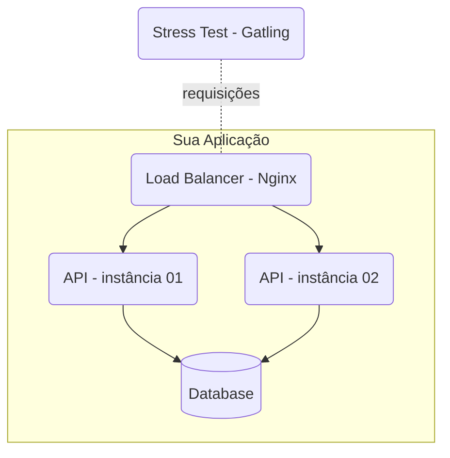

#  Mentoria de Backend - DTI

Este repositório contém a implementação para a **Mentoria de backend  da dti**.  
O objetivo é desenvolver uma API que atenda aos requisitos propostos, rodando em ambiente com **restrições de CPU e memória**, simulando cenários reais de performance, consistência e escalabilidade.

---

##  Resumo

- As APIs devem expor os **mesmos endpoints** (descritos abaixo).
- Banco de dados a escolher: **Postgres, MySQL ou MongoDB**.
- Deploy via **docker-compose**, com limites de CPU e memória.
- O ambiente de testes roda em **AWS EC2**, com **restrições**.
- Testes de stress executados via **Gatling**.

---

##  Endpoints

### 1. Criar Pessoa
`POST /pessoas`

- Cria uma nova pessoa com os atributos:
  - **apelido**: obrigatório, único, até 32 caracteres.
  - **nome**: obrigatório, até 100 caracteres.
  - **nascimento**: obrigatório, formato `AAAA-MM-DD`.
  - **stack**: opcional, array de strings (cada elemento até 32 caracteres).

**Respostas:**
- `201 Created` + Header `Location: /pessoas/{id}` em caso de sucesso.
- `422 Unprocessable Entity` em caso de violação de regra de negócio.
- `400 Bad Request` em caso de JSON inválido.

---

### 2. Detalhar Pessoa
`GET /pessoas/{id}`

- Retorna os detalhes de uma pessoa cadastrada.

**Respostas:**
- `200 OK` com o objeto JSON.
- `404 Not Found` caso não exista.

---

### 3. Buscar Pessoas
`GET /pessoas?t={termo}`

- Busca pessoas pelo termo informado em:
  - **apelido**
  - **nome**
  - **stack**

**Regras:**
- Retorna até **50 resultados**.
- `200 OK` mesmo em resultados vazios.
- `400 Bad Request` se `t` não for informado.

---

### 4. Contagem de Pessoas
`GET /contagem-pessoas`

- Retorna em **texto puro** a quantidade de pessoas cadastradas.
- **Não será testado em performance**, apenas para validação do stress test.

---

##  Arquitetura do Sistema



* **Stress Test (Gatling)**: dispara requisições.
* **Load Balancer (Nginx)**: distribui requests entre as instâncias.
* **APIs (2 instâncias)**: implementam as regras de negócio.
* **Database**: Postgres / MySQL / MongoDB.

---

##  Configuração e Execução

###  Pré-requisitos

Antes de começar, você precisa ter instalado:

* [Docker](https://www.docker.com/)
* [Docker Compose](https://docs.docker.com/compose/)

###  Rodando a aplicação

1. **Clone o repositório**

   ```bash
   git clone https://github.com/seu-usuario/seu-repositorio.git
   cd seu-repositorio
   ```

2. **Configure o banco de dados**  
   O repositório já traz um `docker-compose.yml` de exemplo com **Postgres**.  
   Você pode ajustar caso queira usar **MySQL** ou **MongoDB**.

3. **Suba os containers**

   ```bash
   docker-compose up --build
   ```

4. **Acesse a API**  
   O **Nginx** fará o balanceamento entre duas instâncias da API.  
   O serviço estará disponível em:

   ```
   http://localhost:9999
   ```

---

##  Estrutura do `docker-compose.yml`

```yaml
version: '3.5'
services:
  api1:
    image: api
    hostname: api1
    depends_on:
      - db
    expose:
      - "80"
    deploy:
      resources:
        limits:
          cpus: '0.25'
          memory: '0.5GB'

  api2:
    image: api
    hostname: api2
    depends_on:
      - db
    expose:
      - "80"
    deploy:
      resources:
        limits:
          cpus: '0.25'
          memory: '0.5GB'

  nginx:
    image: nginx:latest
    volumes:
      - ./nginx.conf:/etc/nginx/nginx.conf:ro
    depends_on:
      - api1
      - api2
    ports:
      - "9999:9999"
    deploy:
      resources:
        limits:
          cpus: '0.25'
          memory: '0.5GB'

  db:
    image: postgres
    deploy:
      resources:
        limits:
          cpus: '0.75'
          memory: '1.5GB'
```

 Observação:  
Você terá **1.5 CPUs e 3GB de RAM** no total para distribuir entre os serviços.  
Os limites acima são apenas um exemplo — ajuste como preferir.

---

## 📑 Exemplos de Requisição

### Criar Pessoa

```http
POST /pessoas
Content-Type: application/json
```

```json
{
  "apelido": "ana",
  "nome": "Ana Barbosa",
  "nascimento": "1985-09-23",
  "stack": ["Node", "Postgres"]
}
```

**Resposta:**

```
201 Created
Location: /pessoas/5ce4668c-4710-4cfb-ae5f-38988d6d49cb
```

---

## 🛠️ Tecnologias Utilizadas

* [Docker](https://www.docker.com/) & [Docker Compose](https://docs.docker.com/compose/)
* [Nginx](https://www.nginx.com/)
* Banco de dados: **Postgres / H2 **
* [Gatling](https://gatling.io/) (stress test)

---

## 📖 Referências

* [Regras oficiais da Rinha de Backend](https://github.com/zanfranceschi/rinha-de-backend-2023-q3)
* [Twitter - @zanfranceschi](https://twitter.com/zanfranceschi)
